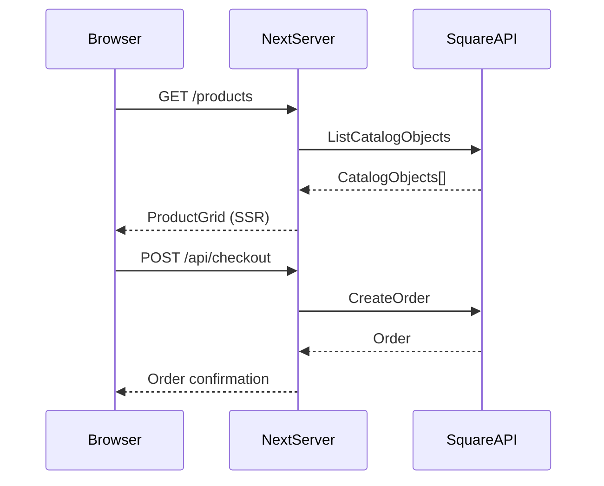

# System Design

> **Category:** Architecture
> **File:** `architecture/system-design.prompt.md`

---

## Purpose

Design the complete system architecture for a feature or service: components, data flow, integration points, caching strategy, and rendering strategy.

## When to Use

- Designing a new feature end-to-end
- Redesigning existing architecture
- Evaluating integration approaches
- Planning performance optimization

## Inputs Required

- Domain model
- User stories with acceptance criteria
- Technology stack constraints
- Performance budgets
- External API documentation

## Outputs Required

1. **Component Architecture**
   - Page hierarchy (routes)
   - Component tree
   - Server vs. Client component boundaries
   - Data requirements per component

2. **Data Flow**
   - Client → Server → External services
   - Caching layers and TTLs
   - Revalidation strategy (ISR/SWR/on-demand)

3. **API Design**
   - Route structure
   - Request/response schemas
   - Error handling approach
   - Rate limiting strategy

4. **Integration Architecture**
   - External service connections (Square)
   - Authentication flow
   - Error handling and retry strategy

5. **Rendering Strategy**
   - SSR vs. SSG vs. CSR per route
   - Dynamic routes with fallback strategy
   - Loading/error/not-found states

6. **Sequence Diagrams** (Mermaid)

## Quality Expectations

- Every component has a clear data requirement
- Every API route has a defined contract
- Every external call has error handling
- No undefined failure modes
- Performance budget compliance

## Failure Cases

- Missing error handling → Add error boundary/handling for every async operation
- No caching strategy → Define cache policy for each data source
- Unclear component boundaries → Split at data dependency boundaries

## Evidence Expectations

- Component tree diagram
- Sequence diagrams for key flows
- API contract specifications
- Architecture Decision Records (ADRs)

## Example Output

